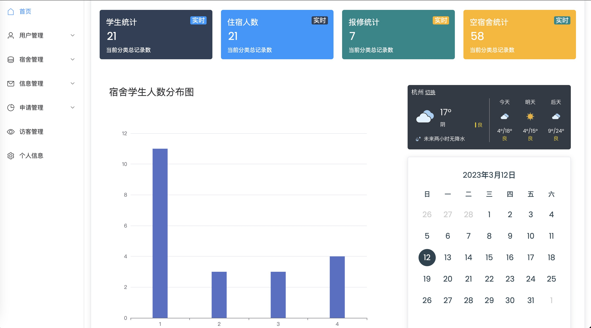
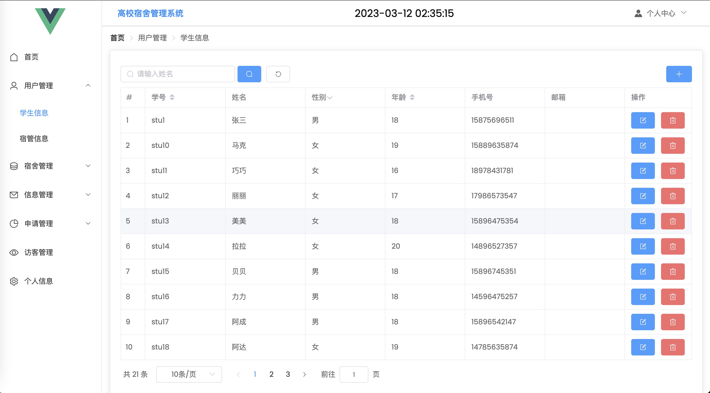
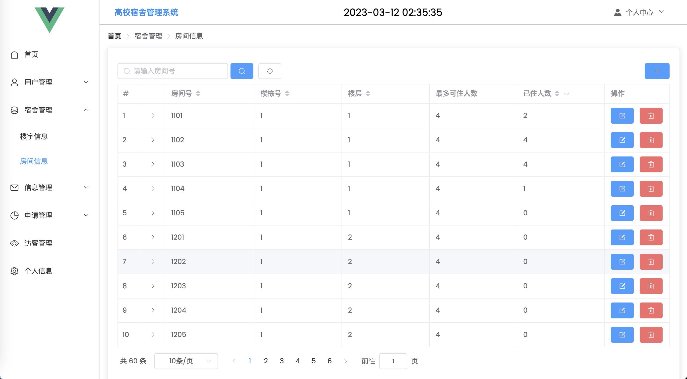
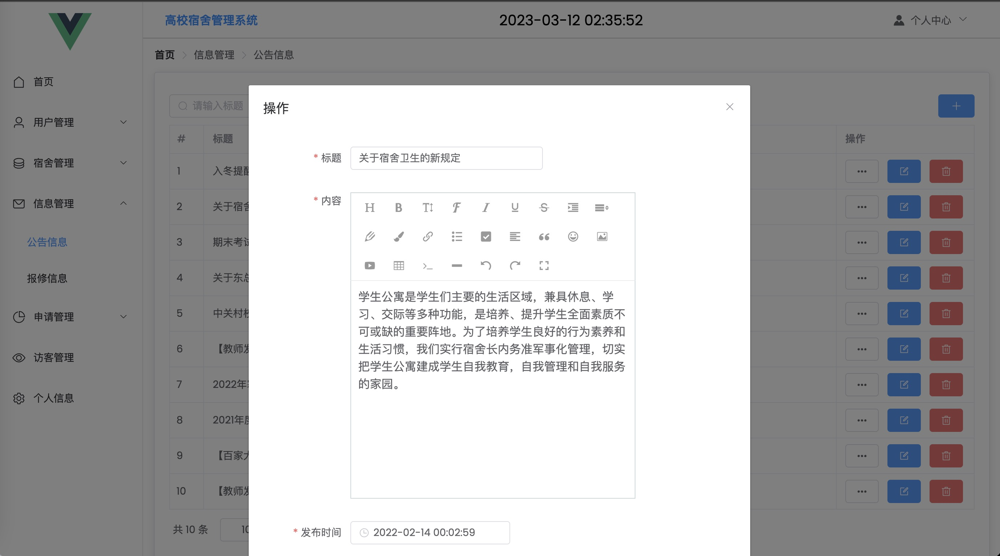
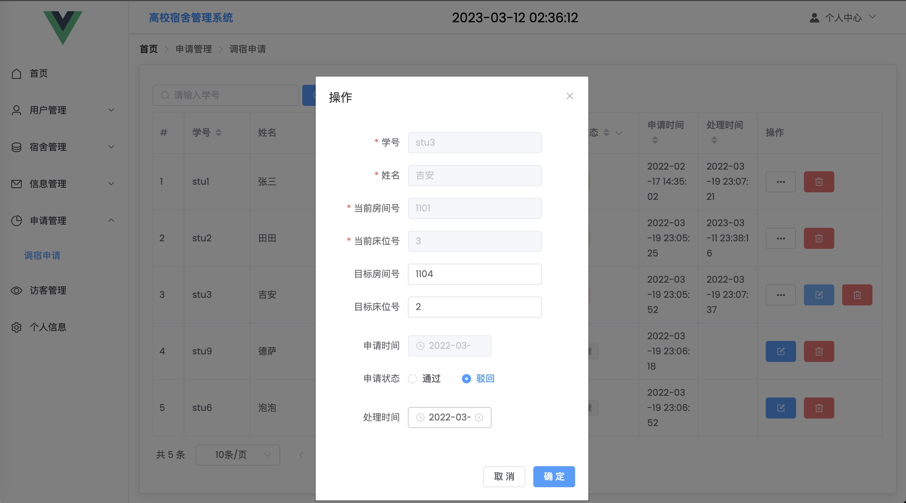
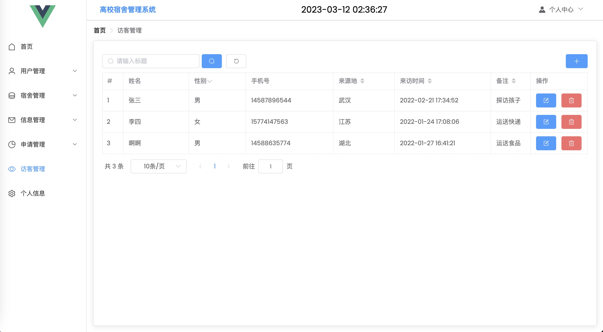
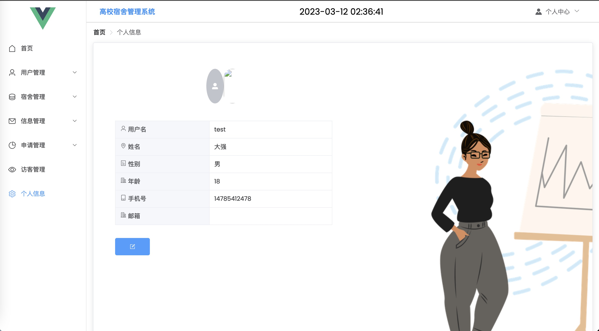
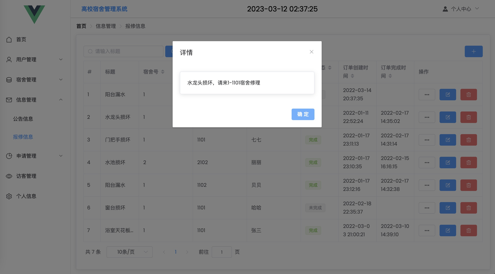

# 宿舍管理系统_毕设

### 系统预览地址
http://39.101.133.125:1003
| 账号    | 密码     |
| -------- | -------- |
| test | admin123 |

(学生/宿舍管理员/系统管理员账号密码都相同)

##### 此账号为演示账号, 权限较低, 如果需要较高权限账号请联系作者
### 作者QQ：1556708905,  (支持修改、 部署调试、 支持代做毕设)

#### 介绍
基于SpringBoot、Vue3 + Element-Plus 实现的宿舍管理系统

#### 系统环境版本说明
JDK >= 1.8 

Mysql >= 5.8.0

Maven >= 3.0

Node >= 12

1.登录页

2. 首页

3.学生信息

